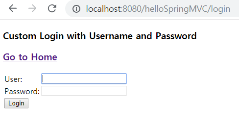
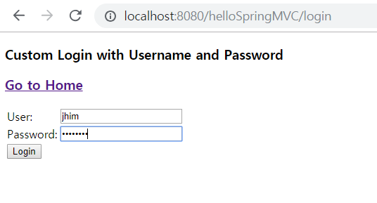
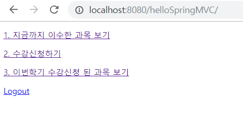
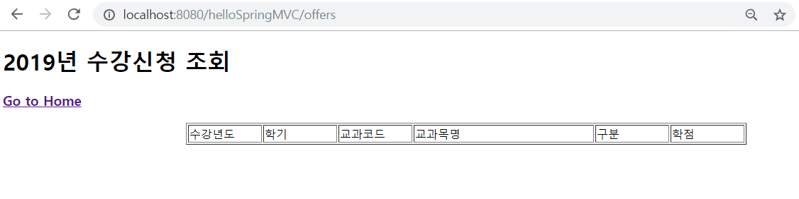
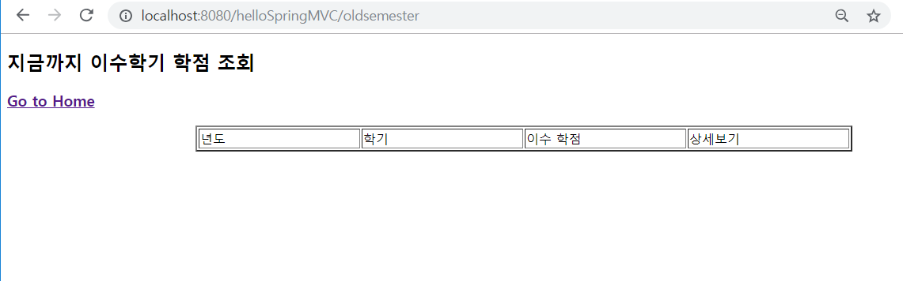
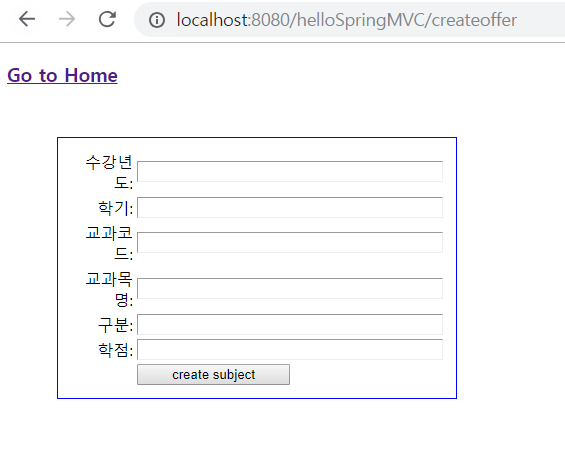
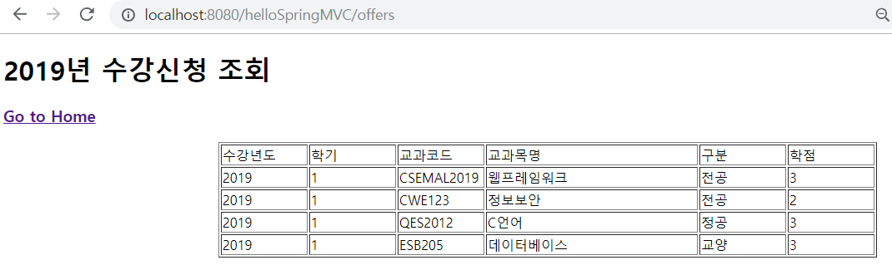
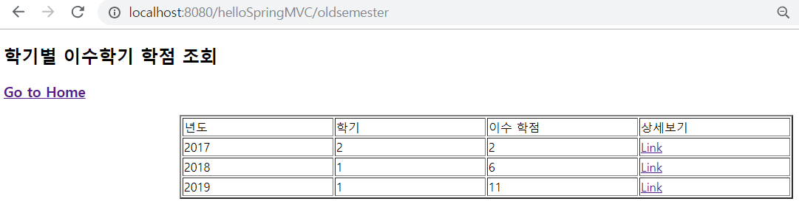
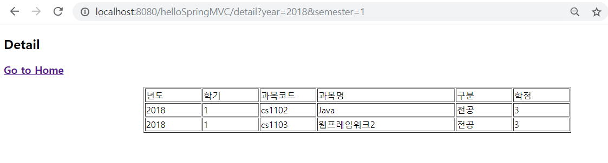
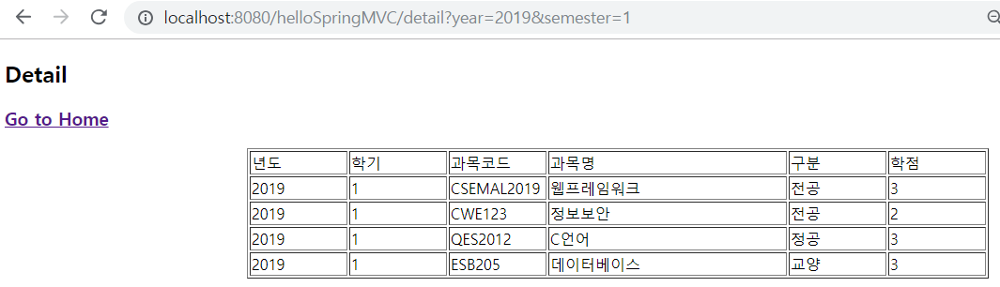

# Web Framework Task 2 (Enabling Spring JDBC+ Spring MVC, WebForm, Security) - Made by JiHwan-Lim (1494034)

# Image of execution result & Description of operation.

 ## 1. First Page (Before login) : If you click 1, 2, 3 , then moved to login page.

 ## 2. Login

 ## 3. After Login : Item 4(Login) on the first page changes to logout.

 ## 4. If you didn't sign up for the class through item 2(Enrolment) on the first page, nothing will appear.

 ## 5. If you didn't sign up for the class through item 2(Enrolment) on the first page, nothing will appear.

 ## 6. enrollment class

 ## 7. After sign up several class : If you go to item 3, then you can see your status of registration in 2019

 ## 8. After sign up several class : If you go to item 1, then you can see all of your status of registration grouped by semester

 ## 9. After click item 1 on the First Page, then click details link to see the courses you took in the 1st semester of 2018

 ## 10. After click item 1 on the First Page, then click details link to see the courses you took in the 1st semester of 2019

 ## 11. If you click item 4(logout), then First Page's item 4(Logout) changed to login.
